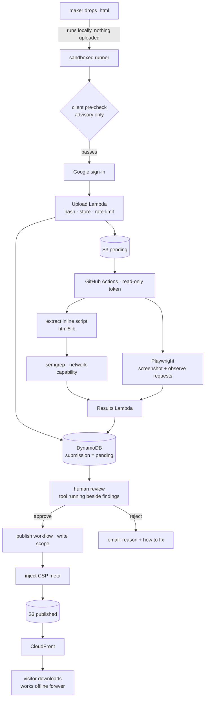

# mimawsi — how the system works

The orientation document. Read this first; it explains the shape and points at the detail.
It is deliberately *not* the spec — `../spec/` is normative and wins any disagreement.

---

## What it is

**mimawsi.com — "Made It, Might As Well Share It".** A free catalogue of small tools, where
a tool is exactly one self-contained HTML file. You try it in the browser, download it, and
double-click it. It works offline, forever, with nothing installed and nobody's permission.

The origin was a newsroom tool that put text on images. It got used and underdelivered — but
the *distribution* was the interesting part: a single file needing no install, no IT ticket,
no account. mimawsi bets that good small tools exist and cannot be found or installed. That
is a **distribution** bet, and it is falsifiable: if nobody wants the tools, a catalogue of
them will not help.

## The one constraint

**A published tool may make no network request of any kind.** No `fetch`, no `XHR`, no
beacons, no remote `src`, no external fonts. Everything inlined, 25 MiB ceiling.

Nearly every other property of the system is downstream of this:

| Consequence | Why it follows |
|---|---|
| **Safety** | A file that cannot reach the network cannot exfiltrate what you put into it. |
| **Offline** | Works on a train, in a field, on a locked-down newsroom laptop. |
| **Zero cost** | No server-side execution means no compute bill. This *is* the business model. |
| **Simple promise** | "Nothing you put in ever leaves your computer" is checkable, not marketing. |

> The rule binds **tools**, not the site. mimawsi's own backend may call an AI model at upload
> time — that is one cost per submission, not per visitor.

## The artifact contract

| Property | Value |
|---|---|
| Format | exactly one `.html` file, all CSS/JS inline, media base64 |
| Size | ≤ 25 MiB (26,214,400 bytes) |
| May do | read files the user picks, process them, generate a download, use local storage |
| May not do | reach the network; Workers, WASM, camera and mic are out of scope for v1 |
| Enforced by | an injected CSP `<meta>`, verified on Chromium, Firefox and WebKit |

## How a tool travels through the system

The two halves are separated on purpose. The **scan workflow** touches hostile input and holds
no credentials. The **publish workflow** holds write scope and never sees an unreviewed file.

## The security model

Three layers, and it matters which does what.

**1. CSP — the only one that actually enforces.** An injected `<meta>` policy the browser obeys.
Verified empirically from `file://` on all three engines: `fetch`, `XHR`, `sendBeacon`, external
images and `eval` all refused, while inline script, `data:`/`blob:` images and blob downloads
work. This travels *inside the downloaded file*, so it protects users forever, off our
infrastructure. See [`../spikes/ed-1-csp/FINDINGS.md`](../spikes/ed-1-csp/FINDINGS.md).

**2. The scanner — advisory, and known to be beatable.** semgrep over JavaScript extracted with
a spec-conforming parser. The literature is clear that static analysis cannot reliably detect
obfuscated malicious JavaScript, so this is not trusted as a control. It auto-rejects only
outbound-network capability; everything else is flagged for a human. Notably it does **not**
reject code for being badly written — that was an explicit product decision.

**3. Humans — the backstop that catches what code cannot.** Every submission is seen by a
person before publication, because a tool displaying something horrific contains no suspicious
code at all. Post-publication, anonymous reports queue for review and the tool stays live
until a human looks.

### What is *not* defended, deliberately

- **Obfuscated network calls** pass the scanner. CSP stops them anyway.
- **Extraction is not provably complete.** Enumerating execution routes (`<script>`, event
  handlers, `javascript:`, `srcdoc`, SVG) is the same losing game as enumerating attacks. It
  fails closed on unparseable input, and CSP backstops it.
- **Ban evasion is trivial** — a new Google account defeats it in a minute. It is a speed bump.
- **Downloads cannot be recalled.** Delisting removes a tool from the catalogue; copies already
  downloaded keep working. Accepted and disclosed.

## Where state lives

| Store | Holds | Why there |
|---|---|---|
| **DynamoDB** (eu-north-1) | accounts, submissions, reports, ban hashes | transactional; conditional writes make the rate limit actually hold |
| **S3** | tool files, pending and published, content-addressed | dedupe, immutability and cache correctness fall out free |
| **git** | published metadata | free audit trail and rebuild trigger — **never** mutable state, it has no transactions |
| **CloudFront** | delivery | 1 TB/month egress free; S3→CloudFront transfer free in-account |

Lambdas are the only writers to DynamoDB. The pipeline reaches it solely through the results
Lambda and holds no database credentials.

## Running it locally

Most of the system needs no AWS, because the core value — a tool running in a browser — needs
no server. **The security-critical parts are the most locally testable.**

| Runs locally | Needs standing in for | Cloud-only |
|---|---|---|
| catalogue, sandboxed runner | Lambdas → local HTTP handlers | CloudFront behaviours |
| drop → run → pre-check (client-side by design) | DynamoDB → **DynamoDB Local** (real emulator) | IAM, Route 53 |
| CSP injector, `file://` regression suite | S3 → filesystem adapter | CDN invalidation |
| script extraction, semgrep rules | SES → console adapter, never sends | SES deliverability |
| screenshots, runtime request observation | | |

DynamoDB gets a real emulator rather than a fake because its semantics — conditional writes,
GSI consistency — are exactly where a hand-rolled double would hide the bug the rate limit
exists to prevent. S3 and SES are simple enough that adapters are safe, and a dev environment
that *can* email real people is a hazard rather than a convenience.

Google sign-in works locally against real Google: `http://localhost:4321/auth/google/callback`
is a registered redirect URI.

## Deliberately absent

Payment · automated rewriting of tools · remix and tool families · maker profiles · a request
board · curated topic pages · ownership and licensing · version history · auto-approval of any
submission · email or GitHub submission routes.

Each was considered and deferred; see [`../spec/grilling-decisions.md`](../spec/grilling-decisions.md).

## Current state

| | |
|---|---|
| Spec pipeline | complete — 40 behaviours, 74 criteria, 49 rules, review **PASS** |
| Infrastructure | provisioned and live: Route 53, ACM, S3, CloudFront, SES |
| `mimawsi.com` | serving a holding page over HTTPS |
| CSP regression suite | 9/9 on Chromium, Firefox and WebKit |
| Application code | **none yet** — phase 1 of `../spec/tasks.yaml` not started |
| Version control | **not yet a git repository** (RULE-1 makes this a prerequisite) |

## Where the detail lives

| Question | File |
|---|---|
| What must it do? | [`../spec/spec.md`](../spec/spec.md) — behaviours B-1…B-40 |
| How do we know it does? | [`../spec/criteria.md`](../spec/criteria.md) — AC-1…AC-70 |
| How must it be built? | [`../spec/rules.md`](../spec/rules.md) — RULE-1…RULE-45 |
| Does it hang together? | [`../spec/review.md`](../spec/review.md) |
| What order? | [`../spec/tasks.yaml`](../spec/tasks.yaml) — 6 phases, 39 tasks |
| Why these decisions? | [`../spec/grilling-decisions.md`](../spec/grilling-decisions.md) |
| What do I have to do by hand? | [`../spec/operator-setup.md`](../spec/operator-setup.md) |
| What needs designing or writing? | [`../spec/design-inventory.md`](../spec/design-inventory.md) |
| What surprises test authors? | [`mimawsi-behaviour.md`](./mimawsi-behaviour.md) |
| Which tests exist? | [`test-plan.md`](./test-plan.md) |
